# Class Diagram

> Architecture overview for the Astro/Vedic chart backend — controllers, services, models, and their relationships.

```mermaid
classDiagram
direction TB

class BaseController {
  <<abstract>>
  #ok(res: Response, data: unknown, message?: string) Response
  #created(res: Response, data: unknown, message?: string) Response
  #fail(res: Response, status: number, message: string) Response
  #asyncHandler(fn: AsyncHandlerFn) RequestHandler
}

class BaseService {
  <<abstract>>
  #serviceName: string
  #logInfo(message: string) void
  #logError(message: string, stack?: string) void
}

class AstroController {
  -signToken(user: JwtUser) string
  +register: RequestHandler
  +login: RequestHandler
  +forgotPassword: RequestHandler
  +resetPassword: RequestHandler
  +deletedAccount: RequestHandler
}

class ChartController {
  -buildChartParamsFromProfile(profile: IUserProfile) VedicParams
  +generateChart: RequestHandler
  +getChart: RequestHandler
  +getChartById: RequestHandler
  +renameChart: RequestHandler
  +saveChart: RequestHandler
  +deleteChart: RequestHandler
}

class DoshaController {
  -resolveDoshaRequest(doshaType: DoshaType, params: VedicParams) Promise~Record<string, unknown>~
  +getDoshaTypes: RequestHandler
  +searchDoshas: RequestHandler
  +checkDosha: RequestHandler
  +getDoshaReport: RequestHandler
  +deleteDoshaReport: RequestHandler
}

class ProfileController {
  -canAccessUser(reqUserId: string, reqUserRole: string, targetUserId: string) boolean
  +createProfile: RequestHandler
  +getProfile: RequestHandler
  +updateProfile: RequestHandler
  +deleteProfile: RequestHandler
}

class UserController {
  +getMe: RequestHandler
  +getUsers: RequestHandler
}

class AstroService {
  #serviceName: string
  -client: AxiosInstance
  +constructor()
  -callApi(endpoint: string, params: Record<string, unknown>) Promise~Record<string, unknown>~
  +fetchManglikDosh(params: VedicParams) Promise~Record<string, unknown>~
  +fetchOtherdosha(params: VedicParams, doshaType: string) Promise~Record<string, unknown>~
  +fetchBirthChart(params: VedicParams) Promise~Record<string, unknown>~
}

class BirthChartService {
  #serviceName: string
  +formatDate(date: Date | string) string
  +isValidTimeFormat(time: string) boolean
  +convertTo24Hour(time12h: string) string
}

class DoshaService {
  #serviceName: string
  +formatDate(date: Date | string) string
  +calculateSeverity(apiResponse: Record<string, unknown>) DoshaSeverity
  +formatReport(report: FormattableDoshaReport) Record<string, unknown>
}

class ProfileService {
  #serviceName: string
  +getProfileByUserId(userId: string) Promise~IUserProfile | null~
  +createProfile(profileData: Partial~IUserProfile~) Promise~IUserProfile~
  +updateProfile(profile: IUserProfile, updates: Record<string, any>) Promise~IUserProfile~
  +softDeleteProfile(profile: IUserProfile) Promise~void~
}

class LoggerService {
  -logger: WinstonLogger
  +info(message: string) void
  +warn(message: string) void
  +error(message: string, stack?: string) void
}

class DoshaReportHelper {
  +isExpired(report: IDoshaReport) boolean
  +cacheReport(data: any) Promise~IDoshaReport~
}

class IAstroService {
  <<interface>>
  +fetchManglikDosh(params: VedicParams) Promise~Record<string, unknown>~
  +fetchOtherdosha(params: VedicParams, doshaType: string) Promise~Record<string, unknown>~
  +fetchBirthChart(params: VedicParams) Promise~Record<string, unknown>~
}

class AuthPayload {
  <<interface>>
  +_id: string
  +email: string
  +role: user | admin
}

class VedicParams {
  <<interface>>
  +dob: string
  +tob: string
  +lat: number
  +lon: number
  +tz: string
}

class User {
  +name: string
  +email: string
  +password: string
  +role: user | admin
  +resetPasswordToken?: string
  +resetPasswordExpires?: Date
  +createdAt: Date
  +updatedAt: Date
}

class UserProfile {
  +userId: ObjectId
  +personalInfo: PersonalInfo
  +timezone: string
  +isDeleted: boolean
  +deletedAt?: Date
  +createdAt: Date
  +updatedAt: Date
}

class PersonalInfo {
  +name: string
  +gender: male | female | other
  +dateOfBirth: Date
  +timeOfBirth: string
  +placeOfBirth: PlaceOfBirth
}

class PlaceOfBirth {
  +city: string
  +state?: string
  +country: string
  +coordinates: Coordinates
}

class Coordinates {
  +latitude: number
  +longitude: number
}

class BirthChart {
  +userId: ObjectId
  +profileId: ObjectId
  +chartName: string
  +chartData: Record<string, unknown>
  +chartImage?: string
  +generatedAt: Date
  +isDeleted: boolean
  +createdAt: Date
  +updatedAt: Date
}

class DoshaReport {
  +userId: ObjectId
  +profileId: ObjectId
  +doshaType: DoshaType
  +inputParams: Record<string, unknown>
  +apiResponse: Record<string, unknown>
  +isPresent: boolean
  +severity: low | medium | high
  +remedies: string[]
  +cachedAt: Date
  +expiresAt: Date
  +createdAt: Date
  +updatedAt: Date
}

class GeoCoordinates {
  <<interface>>
  +latitude: number
  +longitude: number
}

class DoshaType {
  <<type>>
  manglik
  kalsarp
  sadesati
  pitradosh
  nadi
}

BaseController <|-- AstroController
BaseController <|-- ChartController
BaseController <|-- DoshaController
BaseController <|-- ProfileController
BaseController <|-- UserController

BaseService <|-- AstroService
BaseService <|-- BirthChartService
BaseService <|-- DoshaService
BaseService <|-- ProfileService
IAstroService <|.. AstroService

User "1" --> "0..1" UserProfile : userId (unique)
User "1" --> "0..*" BirthChart : userId
UserProfile "1" --> "0..*" BirthChart : profileId
User "1" --> "0..*" DoshaReport : userId
UserProfile "1" --> "0..*" DoshaReport : profileId

UserProfile *-- PersonalInfo
PersonalInfo *-- PlaceOfBirth
PlaceOfBirth *-- Coordinates

AstroController ..> User
UserController ..> User
ChartController ..> UserProfile
ChartController ..> BirthChart
ChartController ..> AstroService
ChartController ..> BirthChartService
DoshaController ..> UserProfile
DoshaController ..> DoshaReport
DoshaController ..> AstroService
DoshaController ..> DoshaService
ProfileController ..> ProfileService
ProfileController ..> BirthChart
ProfileController ..> DoshaReport

BaseService ..> LoggerService
DoshaReportHelper ..> DoshaReport
```

---

## Legend

| Symbol | Meaning |
|--------|---------|
| `<\|--` | Inheritance (extends) |
| `<\|..` | Implementation (implements interface) |
| `-->` | Association / reference |
| `*--` | Composition (owns) |
| `..>` | Dependency (uses) |
| `<<abstract>>` | Abstract class |
| `<<interface>>` | Interface |
| `<<type>>` | Type alias / enum |
| `+` | Public |
| `-` | Private |
| `#` | Protected |

