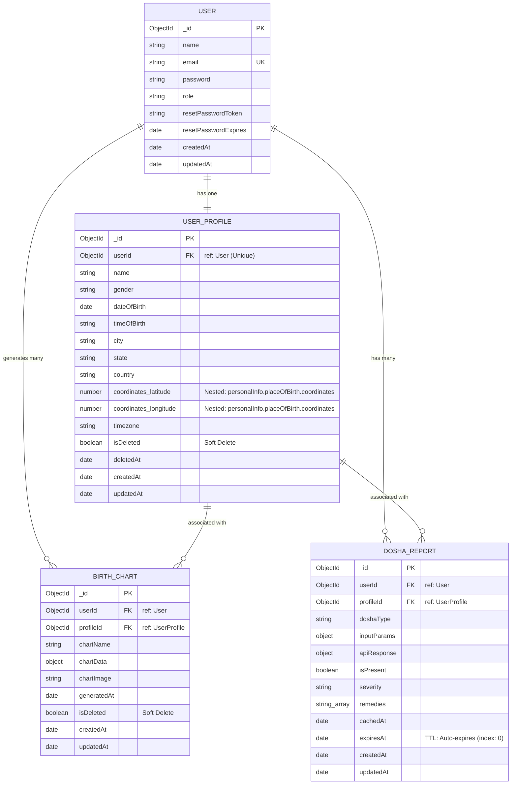

# Entity Relationship Diagram

This diagram represents the data models and their relationships in the Astrology API project.

## Description of Relationships

1.  **User to User Profile (1:1):** Each registered User can have exactly one associated User Profile containing their birth details. The `userId` in `UserProfile` is unique and references the `User`.
2.  **User to Birth Chart (1:N):** A User can generate multiple Birth Charts over time.
3.  **User to Dosha Report (1:N):** A User can have multiple Dosha Reports.
4.  **User Profile to Birth Chart / Dosha Report (1:N):** Birth Charts and Dosha Reports are specific to a User's profile (birth data). Both models maintain a `profileId` reference to ensure the results are linked to the correct birth information.

## Implementation Details

-   **Nested Structure:** In the `USER_PROFILE` model, `latitude` and `longitude` are physically stored within `personalInfo.placeOfBirth.coordinates`, but represented here as logical fields.
-   **Soft Deletes:** Both `USER_PROFILE` and `BIRTH_CHART` implement a soft-delete pattern using the `isDeleted` boolean field.
-   **TTL (Time To Live):** The `DOSHA_REPORT.expiresAt` field is indexed with `expires: 0`, enabling MongoDB's TTL feature to automatically remove expired reports.
