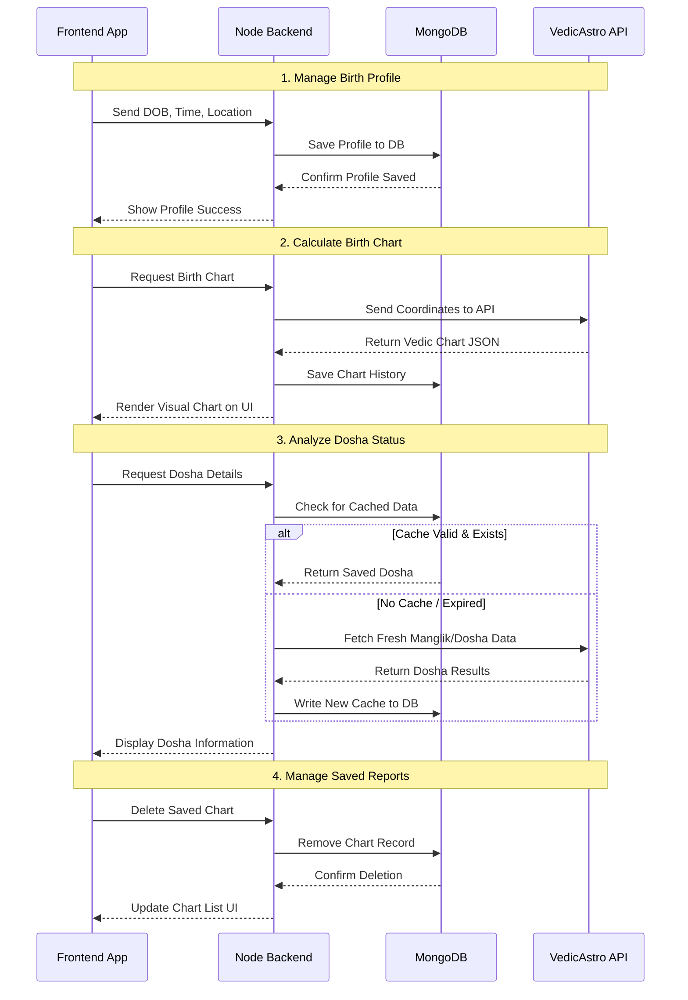

# Simplified Astrology Platform Sequence Diagram

This simplified diagram is designed for easy reproduction in drawing applications like draw.io or Excalidraw, abstracting away deep technical syntax for clear logical flow blocks.

