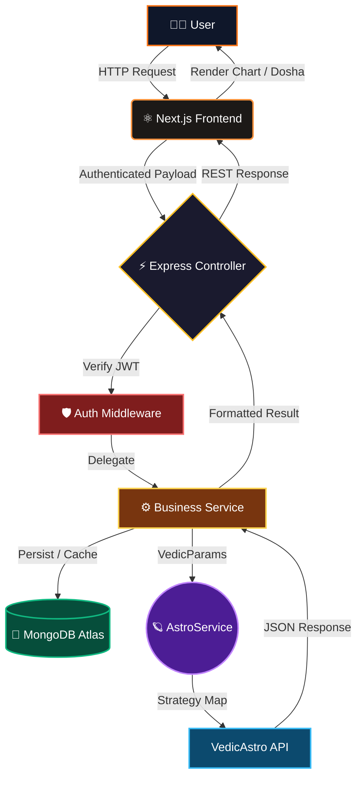
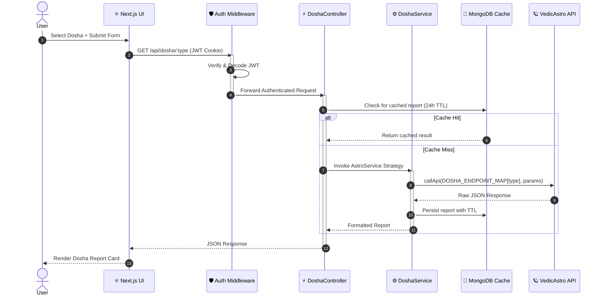

<div align="center">


<h3 align="center">✨ THE VEDIC ASTROLOGY INTELLIGENCE PLATFORM</h3>

<p align="center">
<b>Deepa's Vision</b> is a full-stack Vedic astrology platform that transforms raw birth data into precise astronomical insights — birth charts, planetary dosha detection, and personalized reports, powered by real astronomical computation.
</p>

<p align="center">
  <a href="https://astrology-app-jade.vercel.app"></a>
  <a href="https://deepas-vision-backend-production.up.railway.app/health"></a>
  <a href="#"></a>
  <a href="#"></a>
  <a href="#"></a>
  <a href="#"></a>
</p>

</div>

---

## 🌌 The Vision

Most astrology apps give you a generic horoscope. **Deepa's Vision** gives you the truth. Feed it your birth coordinates and timestamp — and the platform constructs your complete Vedic identity: natal chart, dosha severity, planetary positions, all anchored in real astronomical data. No guesswork. No generic readings. Just pure Jyotish science.

---

## ⚡ Core Arsenal (Features)

<details open>
  <summary><b>🪐 Birth Chart (Kundli) Generation</b></summary>
  <blockquote>Generates a precise Vedic natal chart using real astronomical computations via the VedicAstro API. Planetary positions, house placements, and the full Kundli grid are rendered visually and stored per user for future reference.</blockquote>
</details>

<details open>
  <summary><b>🔮 Dosha Detection Engine</b></summary>
  <blockquote>Detects and analyzes Mangal Dosh, Kaal Sarp Dosh, Sade Sati, Pitra Dosh, and Nadi Dosh from your birth parameters. A 24-hour MongoDB caching layer ensures zero redundant API calls — reports are served instantly on repeat visits.</blockquote>
</details>

<details open>
  <summary><b>👤 Personalized Astrology Profile</b></summary>
  <blockquote>Create and manage a persistent birth profile with name, date of birth, time of birth, birthplace coordinates, gender, and timezone. All charts and doshas are tethered to this profile, building a complete astrological identity over time.</blockquote>
</details>

<details open>
  <summary><b>🛡️ Secure JWT Authentication</b></summary>
  <blockquote>Enterprise-grade security using stateless JWT tokens, HttpOnly cookies, Bcrypt password hashing, and a dedicated <code>AuthMiddleware</code> that guards every private route. The VedicAstro API key never leaves the server.</blockquote>
</details>

<details open>
  <summary><b>📁 Saved Charts & Reports</b></summary>
  <blockquote>View, rename, and delete previously generated birth charts and dosha reports from a dedicated saved history page. Pagination and sort controls keep large chart histories manageable.</blockquote>
</details>

---

## 🧬 Architectural DNA (System Design)

Deepa's Vision operates on a strict **3-Tier MVC-S Architecture** with a secure API proxy layer and an intelligent caching strategy.

<div align="center">



</div>

**Key Security Rule:** The frontend never calls VedicAstro directly. Every external call is proxied through the Express backend — the API key is server-only.

**Caching Strategy:** Dosha reports are persisted in MongoDB with a 24-hour TTL. Repeat requests for the same user + dosha type hit the cache, not the external API.

---

## 🏗️ Design Patterns & SOLID Principles

Deepa's Vision is built on a rigorously structured, enterprise-grade architecture. Every design decision was made to maximize scalability, testability, and separation of concerns.

### 🧩 Core Design Patterns

1. **MVC-S (Model-View-Controller-Service)** *(Architectural Pattern)*  
   **How & Why:** The architectural backbone. Controllers exclusively handle HTTP and delegate everything to Services. Services own all business logic, cache decisions, and API orchestration. Models bind strictly to MongoDB schemas. Zero business logic leaks into controllers.

2. **Observer Pattern** (`UserModel.ts`, `DoshaReportModel.ts`) *(Behavioral Design Pattern)*  
   **How & Why:** Mongoose's `toJSON()` method acts as an observer — the moment a model is serialized for any API response, it automatically strips sensitive fields (`password`, `resetPasswordToken`, `inputParams`, `apiResponse`). Controllers never need to manually filter. It is enforced globally, automatically, for every endpoint.

3. **Strategy Pattern** (`AstroService.ts`) *(Behavioral Design Pattern)*  
   **How & Why:** Each dosha type requires a different VedicAstro endpoint. Rather than a brittle `switch` statement, a `DOSHA_ENDPOINT_MAP` object maps dosha identifiers to their respective endpoints. Adding a new dosha is a one-line map entry — zero changes to the core logic. Pure Strategy.

4. **Template Method Pattern** (`BaseController.ts`) *(Behavioral Design Pattern)*  
   **How & Why:** The `asyncHandler` wrapper in `BaseController` defines a fixed error-handling skeleton. Every controller method runs inside it — if any async operation throws, the error is automatically forwarded to Express's error middleware via `next()`. The template is identical for all 15+ controller methods; no try/catch repetition.

5. **Chain of Responsibility** (`authMiddleware.ts`) *(Behavioral Design Pattern)*  
   **How & Why:** The `AuthMiddleware` intercepts every protected route before the controller sees it. It decodes the JWT, validates the user, and calls `next()` to pass the baton. If the token is invalid or expired, the chain terminates immediately with `401 Unauthorized` — the controller never executes.

### 🏛️ SOLID Principles Implemented

- **S (Single Responsibility):** `AstroService` only calls the external API. `DoshaService` only handles formatting and severity calculation. `BirthChartService` only handles date/time conversions. No class has two unrelated jobs.
- **O (Open/Closed):** The `DOSHA_ENDPOINT_MAP` is closed for modification but open for extension. Adding a new dosha type requires adding one line to the map — no existing methods change.
- **L (Liskov Substitution):** All controllers extend `BaseController`; all services extend `BaseService`. Any subclass can substitute for its parent without breaking the system — verified through constructor-based dependency injection.
- **I (Interface Segregation):** `IAstroService` exposes only astro methods. `ICacheService` exposes only cache methods. No service is forced to implement methods that don't belong to it.
- **D (Dependency Inversion):** `DoshaController` depends on the `IAstroService` interface, not on the concrete `AstroService` class. Swapping the implementation (e.g., for a different astro provider) requires zero changes to the controller layer.

---

## 🎮 Execution Flow (Sequence)

How does a dosha request travel through the system?

<div align="center">



</div>

---

## ⚙️ Hyper-Drive Boot Sequence (Setup)

### Prerequisites

- Node.js `v18+`
- MongoDB running locally or a [MongoDB Atlas](https://www.mongodb.com/cloud/atlas) URI
- A VedicAstro API key from [vedicastroapi.com](https://vedicastroapi.com)

### 1. Clone the Repository

```bash
git clone https://github.com/vedant-valid/SDSE-Project.git
cd SDSE-Project
```

### 2. Ignite the Backend Core

```bash
cd Backend/astrology-api
cp .env.example .env
# Fill in MONGO_URI, JWT_SECRET, and VEDIC_API_KEY
npm install
npm run dev
```

### 3. Spin up the Frontend

```bash
cd Frontend/astrology-app
cp .env.example .env
# Set NEXT_PUBLIC_API_URL=http://localhost:5000/api
npm install
npm run dev
```

### 4. Open in Browser

```
Frontend → http://localhost:3000
Backend  → http://localhost:5000
```

---

## 🌐 Live Demo

| Service | URL |
|---------|-----|
| **Frontend** | https://astrology-app-jade.vercel.app |
| **Backend** | https://deepas-vision-backend-production.up.railway.app |
| **Health Check** | https://deepas-vision-backend-production.up.railway.app/health |

---

## 🔐 Environment Variables

### Backend `.env`

```env
PORT=5000
MONGO_URI=mongodb://localhost:27017/deepasvision
JWT_SECRET=your_jwt_secret_here
JWT_EXPIRES_IN=7d
VEDIC_API_KEY=your_vedicastro_api_key_here
CLIENT_URL=http://localhost:3000
```

### Frontend `.env`

```env
NEXT_PUBLIC_API_URL=http://localhost:5000/api
```

---

## 🗺 Roadmap

- [x] Auth — Register, Login, Forgot/Reset Password
- [x] User Profile — Create & Update birth details
- [x] Birth Chart Generation (Kundli via VedicAstro API)
- [x] Dosha Detection with MongoDB caching (Mangal, Kaal Sarp, Sade Sati, Pitra, Nadi)
- [x] Saved Charts & Reports with pagination
- [ ] Navamsa / D9 Chart Support
- [ ] Kundli Matching (Compatibility Score)
- [ ] Horoscope by Zodiac Sign
- [ ] PDF Export of Birth Charts & Reports
- [ ] Push Notifications for Daily Horoscope
- [ ] Admin Dashboard

---

<div align="center">
  

  <b>Designed for Seekers. Built by the Deepa's Vision Team.</b><br/>
  <i>Leave a ⭐ if the stars aligned for you!</i>
</div>
